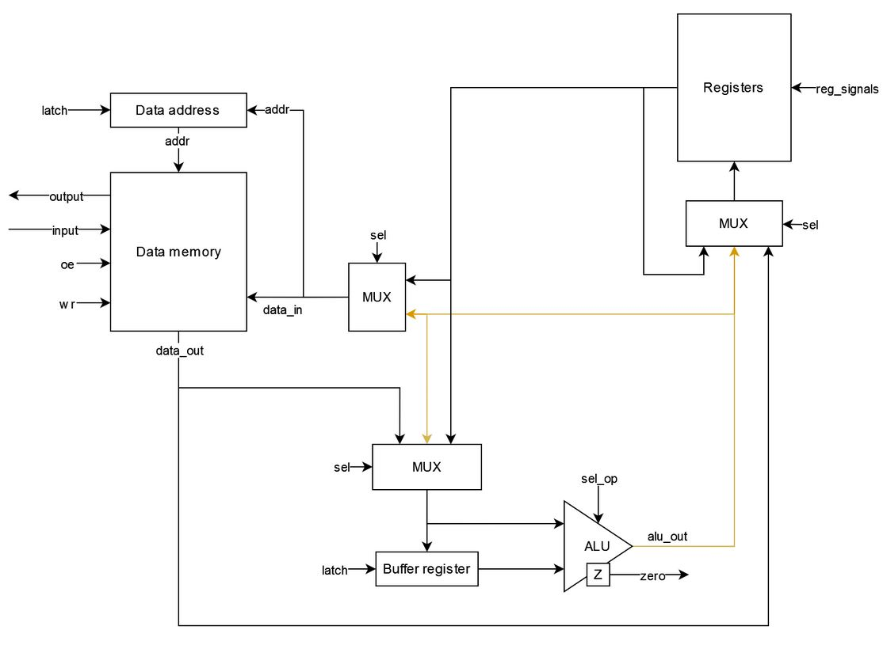
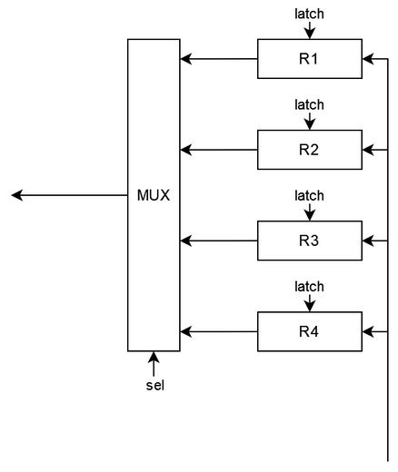
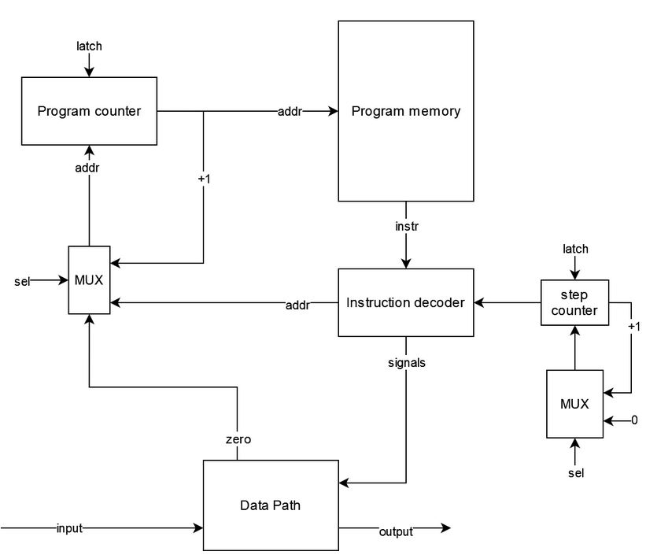

# comp_arch_lab3
3 лабораторная работа по архитектуре компьютера

- Митина Татьяна Олеговна, P3221
- `asm | cisc | harv | hw | instr | struct | stream | mem | cstr | prob1`
- Базовый вариант

## Язык программирования
``` ebnf
program ::= [data_part] [code_part]

data_part ::= ".data:" [comment] "\n" {data_line} 

data_line ::= name data [comment] "\n"

data ::= "NUMBER" number 
       | "STRING" string
       | "BUFFER" number

code_part ::= ".code:" [comment] "\n" {code_line}

code_line ::= label [comment]
            | instr [comment]
            | [comment] "\n"
            
label ::= name ":" "\n"

instr ::= op0
        | op1
        | op2
        | op3
        | long_op
        
op0 ::= "HLT"
     
op1 ::= "JMP" name
      | "JZ" name
      | "INC" reg
      | "INPUT" reg
      | "OUTPUT" reg

op2 ::= "JZ_R" name reg
      | "MOV" reg number
      | "MOV" reg name
      | "LOAD_V" reg name
      | "LOAD_R" reg reg
      | "STORE_V" name reg
      | "STORE_R" reg reg
      | "NEXT" reg reg
      | "CMP" reg number
      
op3 ::= "ADD_MMR" name name reg
      | "MOD_RRV" reg reg number
      
op_long ::= "LINEAR" reg {number reg}
        
comment ::= ";" {<any except "\n">}

number ::= ["-"] { <any of "0-9"> }

name ::= <any of "a-z A-Z _"> { <any of "a-z A-Z 0-9 _"> }

reg ::= "r" <any of "0-9">

string ::= {<any except "\n" ";">}
```

_Операции потока программы_
- `HLT` - стоп программы
- `JMP` - перейти к метке (адресу памяти команд)
- `JZ` - перейти к метке (адресу памяти команд), если установлен флаг `zero`
- `JZ_R` - перейти к метке (адресу памяти команд), если в регистре 0

_Операции работы с регистрами_
- `MOV` - записать в регистр значение
- `LOAD_V` - считать значение в регистр из памяти по адресу-значению
- `LOAD_R` - считать значение в регистр из памяти по адресу-регистру
- `STORE_V` - сохранить в память по адресу-значению из регистра
- `STORE_R` - сохранить в память по адресу-регистру из регистра
- `NEXT` - загрузить в регистр из памяти по адресу-регистру+1 (инкрементировав регистр)

_Арифметические операции_
- `CMP` - сравнить регистр со значением, установить zero
- `INC` - увеличить регистр на 1
- `ADD_MMR` - сохранить в адрес-значение сумму из-адрес-значения и регистра
- `MOD_RRV` - записать в регистр результат нахождения остатка от деления значения в регистре на значение
- `LINEAR` - расчет линейной комбинации регистров (переменное число регистров)

_Операции работы с I\O_
- `INPUT` - считать значение в регистр с ввода 
- `OUTPUT` - вывести значение из регистра на вывод

_Типы данных_
- `STRING` - нул-терминированная строка
- `BUFFER` - буфер заполненный нулями
- `NUMBER` - целое число

Особенности: 
- Код выполняется последовательно
- При трансляции все метки в коде заменяются на соответствующие адреса
- Память выделяется и заполняется начальными значениями статически при запуске модели
- Видимость данных - глобальная
- Литералы:
  - Целое число
  - Строка

## Организация памяти
Модель памяти процессора:
- Гарвардская архитектура - память данных и память команд
- Память команд:
  - Машинное слово - не определено. Эквивалентно экземпляру класса `MachineCode`.
  - Линейное адресное пространство
  - Реализуется списком классов `MachineCode` в модуле [isa](processor/isa.py)
- Память данных:
  - Машинное слово - экземпляр класса MachineCode с одним аргументом - числом, знаковое
  - Линейное адресное пространство
  - Реализуется списком экземпляров класса MachineCode
  - Одно число - одно значение
- Адресация абсолютная (`JMP` `JZ` `JZ_R`)
- Прямая загрузка (`MOV`)
- Абсолютная загрузка (`LOAD_V`, `LOAD_R`)

Модель памяти:
- При запуске программы память выделяется статически и разделена на память данных, команд
- Некоторые команды занимают несколько машинных слов (`LINEAR`)
- В наличии небольшое количество регистров общего назначения (`r1` `r2`...)
- Присутсвуют вспомогательные регистры (`Buffer register`, `Data address`, `Program counter`)
- Можно осуществлять чтение и запись в память данных, в то время как к памяти команд можно обращаться с помощью меток при управлении потоком программы
- Статические данные хранятся в памяти данных. К динамическим данным можно отнести загруженные с помощью `MOV` (загружаются в регистры)

```text
           Registers
+------------------------------+
| r1                           |
| r2                           |
| r3                           |
| ...                          |
+------------------------------+

       Instruction memory
+------------------------------+
| 00  : program start          |
| 01  : instruction            |
|    ...                       |
|    ...                       |
|  n  : HLT
+------------------------------+

          Data memory
+------------------------------+
| 00  : value                  |
| 01  : value                  |
|    ...                       |
| l+0 : string value           |
| l+1 : \0                     |
|    ...                       |
| c+0 : buffer \0              |
| c+1 : buffer \0              |
|    ...                       |
+------------------------------+
```
- Литералы загружаются в регистры с помощью `MOV`
- Литералы изначально находятся в статической памяти, если объявлены в разделе `.data`
  - Порядок такой же как при объявлении
- Строки хранятся по символу в машинном слове, конец строки обозначается с помощью `\0`
- Констант нет
- Инструкции не изменяются после компиляции программы и загрузки их в память
- Переход к следующей инструкции осуществляется
  - Последовательно
  - Безусловно - `JMP`
  - Условно - `JZ` `JZ_R`

## Система команд 
Особенности процессора
- Машинное слово - знаковое число.
- Все данные представлены целым числом, поэтому с ними можно работать как с числом
- Регистры общего назначения доступны для программиста:
  - `R1` `R2` ...
- Специальные регистры не доступны для программиста:
  - `Program counter` - хранит указатель на следующую инструкцию
  - `Buffer register` - хранит значения промежуточных вычислений
  - `Data address` - указатель на ячейку памяти данных
- Доступ к памяти данных осуществляется по адресу, хранящемуся в специальном регистре `Data address`
- Обработка данных:
  - Арифметические операции 
  - Флаг `zero`
  - Операции с регистрами
  - Операциями ввода/вывода
- Ввод/вывод - `memory mapped`
  - Команды ввода/вывода реализованы через `LOAD_V`/`STORE_V`
- Поток управления:
  - Автоинкремент `Program counter`
  - Безусловный переход - `JMP`
  - Условный переход - `JZ`/`JZ_R`, если установлен флаг ZERO/в регистре 0
  - `HLT` - остановка программы

### Набор инструкций
Особенности:
- Все инструкции языка напрямую отображаются в инструкции процессора, кроме:
  - `INPUT` заменяется на `LOAD_V`
  - `OUTPUT` заменяется на `STORE_V`
  - `LINEAR` заменяется на последовательность `LINEAR` + `LINEAR_CONT` ...

Обозначения:
- PM - память команд
- DM - память данных
- DA - адрес данных
- PC - счетчик команд
- R - регистр
- BR - буферный регистр
- Z - zero флаг
- [addr] - адрес в памяти
- [reg] - номер регистра общего назначения
- [value] - значение

Инструкции управления потоком программы

| Инструкция          | Кол-во тактов | Описание                 |
|---------------------|:-------------:|--------------------------|
| `HLT`               |       1       | Остановка программы      |
| `JUMP` [addr]       |       1       | PC = PM[PC]              |
| `JZ` [addr]         |       1       | Если Z: PC = PM[PC]      |
| `JZ_R` [addr] [reg] |       2       | Если R == 0: PC = PM[PC] |

Инструкции работы с регистрами

| Инструкция             | Кол-во тактов | Описание                          |
|------------------------|:-------------:|-----------------------------------|
| `MOV` [reg] [value]    |       1       | R = value                         |
| `LOAD_V` [reg] [addr]  |       2       | DA = addr, R = DM[DA]             |
| `LOAD_R` [reg] [reg]   |       2       | DA = R2, R1 = DM[DA]              |
| `STORE_V` [addr] [reg] |       2       | DA = addr, DM[DA] = R             |
| `STORE_R` [reg] [reg]  |       2       | DA = R1, DM[DA] = R2              |
| `NEXT` [reg] [reg]     |       3       | R2 = R2 + 1, DA = R2, R1 = DM[DA] |

Инструкции арифметики

| Инструкция                        | Кол-во тактов | Описание                                             |
|-----------------------------------|:-------------:|------------------------------------------------------|
| `CMP` [reg] [value]               |       1       | Если R == value: Z = True Иначе Z = False            |
| `INC` [reg]                       |       1       | R = R + 1                                            |
| `ADD_MMR` [addr] [addr] [reg]     |       4       | DA = addr2, BR = DM[DA], DA = addr1, DM[DA] = BR + R |
| `MOD_RRV` [reg] [reg] [value]     |       2       | BR = R2, R1 = BR % value                             |
| `LINEAR` [reg] [value] [reg]      |       2       | BR = value, R1 = BR * R2                             |
| `LINEAR_CONT` [reg] [value] [reg] |       3       | BR = value, BR = BR * R2, R1 = R1 + BR               |

### Кодирование инструкций
- Машинный код сериализуется в список JSON
- Один элемент списка - одна инструкция.
- Индекс списка - адрес инструкции. Используется для команд перехода.
- Вместо меток подставляется адрес в памяти команд
- Все инструкции данных заменяются на соответсвующее данные
- Вместо имен переменных подставляется адрес в памяти данных

Пример:
```
[2,
 {"index": 0, "opcode": "number", "args": [1234]},
 {"index": 1, "opcode": "number", "args": [1234]},
 {"index": 0, "opcode": "load_v", "args": [1, 0]},
 {"index": 1, "opcode": "jz_r", "args": [4, 1]},
 {"index": 2, "opcode": "store_v", "args": [1, 1]},
 {"index": 3, "opcode": "jmp", "args": [0]},
 {"index": 4, "opcode": "hlt", "args": []}]
```

- `index` - адрес в памяти 
- `opcode` - строка с кодом операции
- `args` - до трех аргументов

Типы данных в модуле [isa](processor/isa.py), где:
- Operation - перечисление операций АЛУ
- Opcode - перечисление кодов операций
- MachineCode - структура для описания значимого фрагмента кода исходной программы

## Транслятор
Интерфейс командной строки:
```
usage: translator.py [-h] source_file target_file
                                                 
Трансляция кода                                  
                                                 
positional arguments:                            
  source_file  Имя файла с кодом                 
  target_file  Имя выходного файла

options:
  -h, --help   show this help message and exit 
```

Реализовано в модуле [translator.py](./translator.py)

Принципы работы:
- Пустые строки или только с комментариями пропускаются
- Комментарии в строках отсекаются
- Два прохода: разделение на токены и подстановка адресов
- Проверяется корректное число токенов в строке
- Проверяется, что метки и имена переменных не были переопределены
- Отдельная обработка сначала `.data`, потом `.code`
- Подстановка адресов `INPUT_MAP`, `OUTPUT_MAP`
- `.data`:
  - Разделение на 3 токена по первым 2 пробелам
  - Замена на данные по типу данных
     - `NUMBER` - по значению
     - `STRING` - каждый символ = одно машинное слово, заканчивается `\0`
     - `BUFFER` - заменяется на n `\0`
  - Сохранение адреса переменной для последующей замены обращений по имени
  - Первым словом записывается длина части данных
- `.code`
  - Если оканчивается на `:` - метка, сохраняется адрес для последующей замены обращений по имени
  - Прямое отображение в машинный код
    - `INPUT` заменяется на `LOAD_V`
    - `OUTPUT` заменяется на `STORE_V`
    - `LINEAR` заменяется на последовательность `LINEAR` + `LINEAR_CONT` ...

## Модель процессора
Интерфейс командной строки:
```
usage: simulation.py [-h] [--debug_limit DEBUG_LIMIT] [--limit LIMIT] code_file [input_file]

Симуляция процессора

positional arguments:
  code_file             Имя файла бинарным с кодом
  input_file            Имя входного файла (опционально)

options:
  -h, --help            show this help message and exit
  --debug_limit DEBUG_LIMIT
                        Лимит отладки (по умолчанию 200)
  --limit LIMIT         Лимит тиков (по умолчанию 100000)
```

Реализован в модуле: [simulation.py](./simulation.py)

Особенности:
- CISC архитектура
- Подготовка и запуск модели происходит в методе `simulation`
- Шаг моделирования соответствует одной инструкции с выводом состояния в журнал
- Для журнала состояний процессора используется стандартный модуль `logging`
  - Текущая инструкция
  - Текущий тик
  - Состояние регистров
- Количество инструкций для моделирования и логирования лимитировано
- Остановка моделирования осуществляется при:
  - Превышении лимита количества выполняемых инструкций;
  - Исключении `EOFError` -- если нет данных для чтения из порта ввода;
  - Исключении `StopIteration` -- если выполнена инструкция `HALT`.

### DataPath




Реализован в классе `DataPath` в модуле [data_path.py](./processor/data_path.py)
- `Data memory` - однопортовая память: либо читаем, либо пишем
- `ALU` - АЛУ для выполнения арифметических операций
- `Data address` - указатель на данные
- `Buffer register` - регистр для промежуточных вычислений
- `input`/`output` - порты ввода/вывода

Сигналы:
- Реализованы в виде методов класса
- Обрабатываются за один такт
- Приходят от `Control Unit`
- `latch` - защёлкнуть соответствующий регистр
- `sel` - выбрать значение на соответствующеем мультиплексоре
- `we` - активна запись в память
- `oe` - активно чтение из памяти
- `alu_op` - выбор арифметической операции
- `register_signals` - сигналы управления регистрами

Флаги:
- `zero` - для потоков управления, отражает нулевое значение последней операции

### ControlUnit


Реализован в классе `ControlUnit` в модуле [control_unit.py](./processor/control_unit.py)   
- Hardwired (реализовано полностью на Python)
- Цикл процессора реализован в методе `decode_and_execute` (`step_counter` для многотактовых инструкций)
  1. Получение инструкции
  2. Определение `opcode`
  3. Отправка сигналов
  4. Увеличение счетчика тиков
  5. Переход к следующей инструкции

- `Program memory` - только читаем
- `Program counter` - указатель на следующую инструкцию
- `Instruction decoder` - хранит, декодирует опкод операции и отправляет сигналы
- `Step counter` - для многотактовых инструкций
- `input`/`output` - ввод/вывод

Сигналы:
- Реализованы в виде методов класса
- Обрабатываются за один такт
- Приходят от `Control Unit`
- `latch` - защёлкнуть соответствующий регистр
- `sel` - выбрать значение на соответсвующее мультиплексоре

## Тестирование
Тестирование выполняется при помощи golden test-ов

- Реализованные программы лежат в [tasks](./tasks)
- Предлагаемые входные данные лежат в [inputs](./inputs)
- Конфигурации golden test-ов лежат в [golden](./golden) в виде файлов формата _.yml_
  - Код программы
  - Входные данные
  - Машинный код 
  - Выходные данные
  - Журнал работы процессора

Алгоритмы:
- Обязательные, минимум логов, демонстрирующие правильность работы процессора на разных алгоритмах и поведение процессора
  - [cat](./golden/cat.yml) - вывод потенциально бесконечных входных данных
  - [hello](./golden/hello.yml) - вывод сообщения
  - [hello_user](./golden/hello_user.yml) - вывод приветствия пользователя с учетов ввода
  - [prob1](./golden/prob1.yml) - алгоритм на работу с числами
- Доп
  - [cool_command](./golden/cool_command.yml) - демонстрация сложной команды  

Запустить тесты: `poetry run pytest . -v`

Обновить конфигурацию golden tests: `poetry run pytest . -v --update-goldens`

Разбор теста `cat` ([cat](./golden/cat.yml))
- Код программы
```text
.code               ; обозначаем начало раздела кода

main_loop:          ; метка `main_loop`
    INPUT r2        ; считываем значение с ввода в регистр #2
    JZ_R end r2     ; проверяем значение регистра #2 на 0 и если да - прыгаем к метке `end`
    OUTPUT r2       ; выводим значение из регистра #2
    JMP main_loop   ; прыгаем к метке `main_loop`

end:
    HLT             ; остановка работы программы
```
- Вывод транслятора
```
python .\translator.py .\tasks\cat.txt .\out\cat.out
LoC: 13 Instr: 8
```
- Машинный код
```
[2,                                                 ; длина части данных
 {"index": 0, "opcode": "number", "args": [1234]},  ; порт ввода
 {"index": 1, "opcode": "number", "args": [1234]},  ; порт вывода
 {"index": 0, "opcode": "load_v", "args": [1, 0]},  ; инструкции ...
 {"index": 1, "opcode": "jz_r", "args": [4, 1]},
 {"index": 2, "opcode": "store_v", "args": [1, 1]},
 {"index": 3, "opcode": "jmp", "args": [0]},
 {"index": 4, "opcode": "hlt", "args": []}]
```
- Вывод процессора (логирование уровня INFO)
```
python .\simulation.py .\out\cat.out .\inputs\catInput.txt
INFO:root:Start simulation
WARNING:root:Debug limit exceeded!
INFO:root:output_buffer: Hello, World! This is a test file for the cat command.

INFO:root:End simulation
Hello, World! This is a test file for the cat command.

Instructions: 223 Ticks: 389
```
- Журнал работы, логирование уровня DEBUG (часть)
```
python .\simulation.py .\out\cat.out .\inputs\catInput.txt
INFO:root:Start simulation
DEBUG:root:input: H
DEBUG:root:TICK:    2 [ 1: JZ_R   ] PC:  1 DR:  0 SB:  0 RG: [0, 72, 0, 0] 
DEBUG:root:TICK:    4 [ 2: STORE_V] PC:  2 DR:  0 SB:  0 RG: [0, 72, 0, 0] 
DEBUG:root:output: H << 72
DEBUG:root:TICK:    6 [ 3: JMP    ] PC:  3 DR:  1 SB:  0 RG: [0, 72, 0, 0]
DEBUG:root:TICK:    7 [ 0: LOAD_V ] PC:  0 DR:  1 SB:  0 RG: [0, 72, 0, 0]
DEBUG:root:input: e
DEBUG:root:TICK:    9 [ 1: JZ_R   ] PC:  1 DR:  0 SB:  0 RG: [0, 101, 0, 0]
DEBUG:root:TICK:   11 [ 2: STORE_V] PC:  2 DR:  0 SB:  0 RG: [0, 101, 0, 0]
DEBUG:root:output: He << 101
DEBUG:root:TICK:   13 [ 3: JMP    ] PC:  3 DR:  1 SB:  0 RG: [0, 101, 0, 0]
DEBUG:root:TICK:   14 [ 0: LOAD_V ] PC:  0 DR:  1 SB:  0 RG: [0, 101, 0, 0]
DEBUG:root:input: l
DEBUG:root:TICK:   16 [ 1: JZ_R   ] PC:  1 DR:  0 SB:  0 RG: [0, 108, 0, 0]
DEBUG:root:TICK:   18 [ 2: STORE_V] PC:  2 DR:  0 SB:  0 RG: [0, 108, 0, 0]
DEBUG:root:output: Hel << 108
DEBUG:root:TICK:   20 [ 3: JMP    ] PC:  3 DR:  1 SB:  0 RG: [0, 108, 0, 0]
DEBUG:root:TICK:   21 [ 0: LOAD_V ] PC:  0 DR:  1 SB:  0 RG: [0, 108, 0, 0]
DEBUG:root:input: l
DEBUG:root:TICK:   23 [ 1: JZ_R   ] PC:  1 DR:  0 SB:  0 RG: [0, 108, 0, 0]
DEBUG:root:TICK:   25 [ 2: STORE_V] PC:  2 DR:  0 SB:  0 RG: [0, 108, 0, 0]
DEBUG:root:output: Hell << 108
DEBUG:root:TICK:   27 [ 3: JMP    ] PC:  3 DR:  1 SB:  0 RG: [0, 108, 0, 0]
DEBUG:root:TICK:   28 [ 0: LOAD_V ] PC:  0 DR:  1 SB:  0 RG: [0, 108, 0, 0]
DEBUG:root:input: o
DEBUG:root:TICK:   30 [ 1: JZ_R   ] PC:  1 DR:  0 SB:  0 RG: [0, 111, 0, 0]
DEBUG:root:TICK:   32 [ 2: STORE_V] PC:  2 DR:  0 SB:  0 RG: [0, 111, 0, 0]
DEBUG:root:output: Hello << 111
DEBUG:root:TICK:   34 [ 3: JMP    ] PC:  3 DR:  1 SB:  0 RG: [0, 111, 0, 0]
DEBUG:root:TICK:   35 [ 0: LOAD_V ] PC:  0 DR:  1 SB:  0 RG: [0, 111, 0, 0]
DEBUG:root:input: ,
DEBUG:root:TICK:   37 [ 1: JZ_R   ] PC:  1 DR:  0 SB:  0 RG: [0, 44, 0, 0]
DEBUG:root:TICK:   39 [ 2: STORE_V] PC:  2 DR:  0 SB:  0 RG: [0, 44, 0, 0]
DEBUG:root:output: Hello, << 44
DEBUG:root:TICK:   41 [ 3: JMP    ] PC:  3 DR:  1 SB:  0 RG: [0, 44, 0, 0]
DEBUG:root:TICK:   42 [ 0: LOAD_V ] PC:  0 DR:  1 SB:  0 RG: [0, 44, 0, 0]
DEBUG:root:input:
DEBUG:root:TICK:   44 [ 1: JZ_R   ] PC:  1 DR:  0 SB:  0 RG: [0, 32, 0, 0]
DEBUG:root:TICK:   46 [ 2: STORE_V] PC:  2 DR:  0 SB:  0 RG: [0, 32, 0, 0]
DEBUG:root:output: Hello,  << 32
DEBUG:root:TICK:   48 [ 3: JMP    ] PC:  3 DR:  1 SB:  0 RG: [0, 32, 0, 0]
DEBUG:root:TICK:   49 [ 0: LOAD_V ] PC:  0 DR:  1 SB:  0 RG: [0, 32, 0, 0]
```

### CI
CI при помощи Github Action

[python.yml](./.github/workflows/python.yml)
- `poetry` - управления зависимостями для языка программирования Python.
- `coverage` - формирование отчёта об уровне покрытия исходного кода.
- `pytest` - утилита для запуска тестов.
- `ruff` - утилита для форматирования и проверки стиля кодирования.

Запускается при пуше в репозиторий на ветку мастер
Тестовые процессы
- `test` - запуск тестов
- `lint` - запуск линтера

### Для сбора аналитики

| ФИО                      | алг             | LoC | code байт | code инстр. | инстр. | такт. | вариант                                                                  |
|:-------------------------|:----------------|:----|:----------|:------------|:-------|:------|:-------------------------------------------------------------------------|
| Митина Татьяна Олеговна  | cat             | 13  | -         | 8           | 223    | 389   | `asm - cisc - harv - hw - instr - struct - stream - mem - cstr - prob1`  |
| Митина Татьяна Олеговна  | hello           | 16  | -         | 22          | 48     | 93    | `asm - cisc - harv - hw - instr - struct - stream - mem - cstr - prob1`  |
| Митина Татьяна Олеговна  | hello_user_name | 37  | -         | 70          | 101    | 183   | `asm - cisc - harv - hw - instr - struct - stream - mem - cstr - prob1`  |

